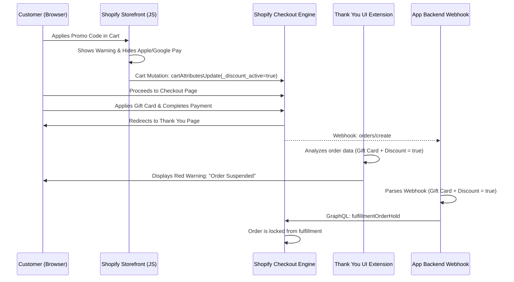

# Technical Architecture — CartSafe POC

This document outlines the technical design, system components, and data flow of the CartSafe Shopify application.

---

## 1. System Overview

CartSafe uses a three-stage native architecture to detect and manage coupon and gift card stacking:
- **Stage 1 (Frontend Deterrent):** A storefront JS observer that sets a custom cart attribute and hides express checkout buttons, warning the user not to stack discounts.
- **Stage 2 (Post-Purchase UX Feedback):** A Checkout UI Extension running on the "Thank You / Order Status" page that immediately detects stacking and displays a visual warning block to the customer that their order is suspended.
- **Stage 3 (The Enforcer):** An asynchronous Node.js webhook listener that intercepts the newly created order, validates the stacking violation, and places the order on a native Shopify fulfillment hold.

---

## 2. Component Diagram

```
                                  +------------------------------------+
                                  |         Shopify Storefront         |
                                  |  (Theme App Extension / JS Script) |
                                  +-----------------+------------------+
                                                    | (Sets Cart Attr / Hides Express buttons)
                                                    v
+-----------------------------+   GraphQL   +------------------------------------+
|                             | <---------> |          Shopify Core              |
|     CartSafe App Backend    |             |        (Checkout Engine)           |
| (Remix / Node.js on Vercel) | <---------  +-----------------+------------------+
|                             |   Webhooks                    |
+--------------+--------------+                               | (Customer lands on Thank You page)
               |                                              v
               | Prisma ORM                         +--------------------+
               v                                    |    Checkout UI     |
+-----------------------------+                     |      Extension     |
|         Database            |                     | (Thank You Widget) |
|    (Supabase Postgres)      |                     +--------------------+
+-----------------------------+                     
```

---

## 3. Component Details

### A. Storefront Observer (Theme App Extension)
- **Technology:** Vanilla JavaScript (Liquid / HTML).
- **Function:** Monitors the cart's coupon code state. If a coupon is applied:
  1. Sets a cart attribute: `_discount_active = true` via the Storefront Cart API.
  2. Hides native express checkout buttons (Apple Pay, Google Pay) using DOM manipulation.
  3. Displays a warning that combining codes with gift cards will result in order suspension.

### B. Thank You Page Widget (Checkout UI Extension)
- **Technology:** React (Shopify UI Extensions API).
- **Target:** `purchase.thank_you.block.render` / `customer_account.order.status.block.render`.
- **Function:**
  1. Reads the `order.discountApplications` and `order.appliedGiftCards` arrays directly from the client-side API.
  2. If both exist and indicate stacking, renders a prominent Banner warning the customer: *"Your order is on hold because promo codes and gift cards cannot be combined. Please contact support."*

### C. App Backend (Remix & Node.js)
- **Technology:** Node.js, Remix framework, Prisma.
- **Function:**
  1. Handles Shopify OAuth installer flow.
  2. Provides an embedded admin dashboard using Shopify Polaris React components.
  3. Listens to `orders/create` webhook.
  4. Parses the order payload. If both a discount code and gift card transaction are present, invokes the Admin GraphQL `fulfillmentOrderHold` mutation.

### D. Database (Supabase PostgreSQL)
- **Technology:** PostgreSQL hosted on Supabase.
- **Tables:**
  - `stores`: Stores the offline access token and configurations for each merchant.
  - `held_orders`: Log of all orders that triggered the fulfillment hold safety net.

---

## 4. Key Execution Sequence (Violating Checkout)


