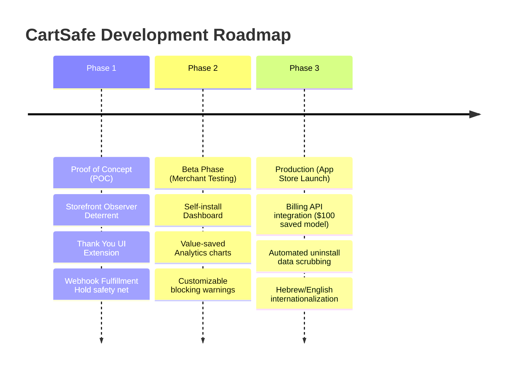

# Product Roadmap (ROADMAP) — CartSafe

This document outlines the development path of CartSafe, dividing it into three core phases: from proof-of-concept validation to full Shopify App Store listing.

---

## 🗺️ Phases Overview

---

## 🎯 Phase 1: Proof of Concept (POC) — [CURRENT]
**Goal:** Validate post-transaction blocking mechanics and frontend deterrents on Shopify Basic plans using native Checkout Extensibility without introducing checkout failures.

- **Storefront JS Observer:** Appends `_discount_active = true` attribute to cart when coupon is entered. Shows warning and hides Apple Pay / Google Pay express buttons.
- **Thank You Page UI Extension:** A React widget that runs on the Order Status page. Analyzes `order.appliedGiftCards` and `order.discountApplications`, displaying a prominent red "Order Suspended" banner if stacking is detected.
- **Fulfillment Hold (Webhook):** Listens to `orders/create` to instantly capture stacked checkouts and place orders on native fulfillment holds via the Admin API.
- **Prisma & Supabase Database:** Configured under a strict No-PII database storage policy (no customer emails, names, or unmasked gift cards).
- **Merchant Dashboard:** Basic list of held orders and flat cumulative margin savings tracker.

---

## 🚀 Phase 2: Beta Phase (Merchant Testing)
**Goal:** Deploy CartSafe to a small group of trusted merchants to gather live-transaction telemetry and refine UI usability.

- **Embedded Install Flow:** Streamlined Shopify Admin App Bridge installation allowing merchants to self-install and activate the app with a single toggle.
- **Analytics Dashboard:** Graphical charts showing blocked attempts, distribution of blocked coupons, and daily/monthly savings reports.
- **Customizable Warning Copy:** Merchant-configurable error warnings to show on the Thank You page and cart drawer (e.g. customized translation or branding).
- **Merchant Alert System:** E-mail or dashboard alert notifications notifying merchants whenever the webhook holds an order (including quick actions to release or cancel).

---

## 🏆 Phase 3: Production (Shopify App Store Launch)
**Goal:** Achieve App Store compliance and launch CartSafe globally as a public application.

- **Billing API Integration:** Automated Shopify Billing API integration supporting the **Value-First Pricing Model** (free until $100 saved, then flat $9.99/month).
- **Offboarding & Data Scrubbing (GDPR/Compliance):** Clean uninstall hooks that automatically remove storefront observers, deregister UI Extensions, and invoke data-scrubbing scripts to delete store offline tokens.
- **Hebrew/English Localization:** Complete translation toggle inside the merchant admin UI and standard support for right-to-left (RTL) Hebrew locales on Shopify themes.
